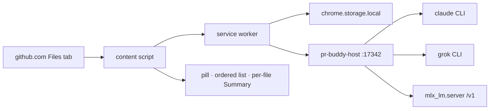
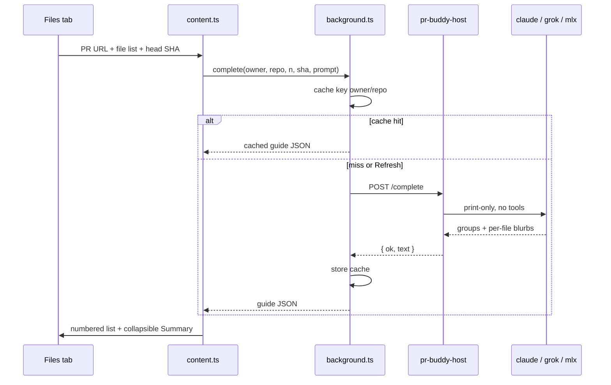
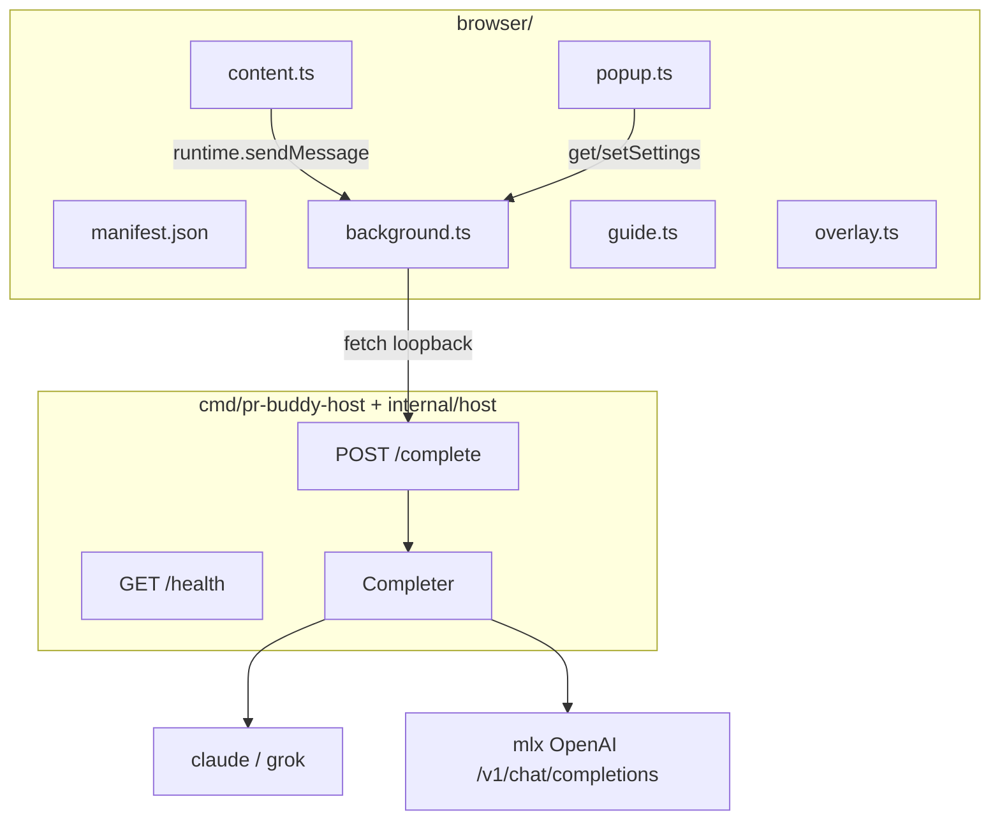
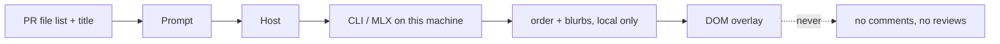

# pr-buddy

Chrome overlay on github.com pull request Files tabs (`/files` and `/changes`).

It asks a local model for an **understand-first file order**, replaces GitHub’s
left file list with that order, and puts a **collapsed summary** on each diff.
You still write the review. No findings. No draft comments.



## What you see

| Surface | What it does |
|---|---|
| **Status pill** (next to Ready to merge) | Click for model picker + **Refresh order**. |
| **Left file list** | Numbered paths in review order. No blurbs here. |
| **Each stacked diff** | Collapsed **Summary** under the file header. |

Order: contracts / types / entrypoints → implementation → wiring → tests.

## How a request flows



Cache key: `{owner}/{repo}#{number}:{headSHA}:{backend}`. Same head + same
backend does not reshuffle. **Refresh order** ignores the cache.

## Repo layout

Live surface only. The old VS Code extension is gone. The unused Go review
engine (`cmd/pr-buddy`, worktrees, `internal/runner`) is still in the tree.

```
pr-buddy/
├── browser/                    Chrome MV3 unpacked extension
│   ├── manifest.json
│   ├── popup.html              toolbar popup (host health + backend)
│   ├── src/
│   │   ├── content.ts          GitHub overlay, pill dialog, tree, summaries
│   │   ├── background.ts       cache + POST :17342/complete
│   │   ├── popup.ts
│   │   ├── guide.ts            parse / flatten / cacheKey
│   │   ├── overlay.ts          dock pill, find file tree, order helpers
│   │   ├── pr.ts               URL + file-list scrape
│   │   ├── prompt.ts           understand-first prompt
│   │   ├── settings.ts         claude | grok | mlx
│   │   └── styles.css          GitHub light/dark tokens
│   └── out/                    esbuild IIFE bundles
├── cmd/pr-buddy-host/          loopback model router
├── internal/host/              /health, /complete, CLI + MLX adapters
└── install-browser.sh
```



## Prerequisites

| | Why |
|---|---|
| **Chrome** | Only supported browser. github.com only. |
| **Go 1.24+** | Builds `pr-buddy-host`. |
| **Node 18+ / npm** | Builds the unpacked extension. |
| **At least one backend** | `claude` CLI, `grok` CLI, or `mlx_lm.server` on loopback. |

## Install

```sh
./install-browser.sh
```

Then:

1. Leave `./pr-buddy-host` running (`127.0.0.1:17342`).
2. Chrome → `chrome://extensions` → Developer mode → Load unpacked → `browser/`.
3. Open a PR Files tab. After changing `browser/src`, refresh the extension, then hard-reload the tab.
4. Click the **pr-buddy** pill to pick `claude` / `grok` / `mlx`. For MLX, set the URL (default `http://127.0.0.1:8080/v1`) and model id.

## Safety

- Host binds **loopback only**.
- MLX URLs are rejected unless they are loopback.
- Claude/Grok run print-only, no tools, `--permission-mode dontAsk`.
- Nothing from the PR is built, installed, or executed.
- Comments stay in the GitHub UI, written by you.



## Development

```sh
go test ./...
go test ./internal/host
cd browser && npm test && npm run compile
```
