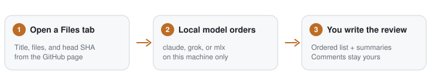

<p align="center">
  
</p>

<h1 align="center">pr-buddy</h1>

<p align="center">
  Understand-first file order for GitHub pull requests.<br>
  You still write every comment.
</p>

GitHub lists changed files alphabetically. pr-buddy is a Chrome overlay on the Files tab that asks a **local** model for a reading order — contracts and types first, then implementation, then wiring, then tests — and rewrites the file list and stacked diffs to match.

No findings. No draft comments. The review stays yours.

<p align="center">
  
</p>

## Install

**Need:** Chrome, [Go 1.24+](https://go.dev/dl/), Node 18+, and at least one backend — [`claude`](https://docs.anthropic.com/en/docs/claude-code) CLI, [`grok`](https://docs.x.ai/docs) CLI, or [`mlx_lm.server`](https://github.com/ml-explore/mlx-lm) on loopback.

```sh
git clone https://github.com/anubhavitis/pr-buddy.git
cd pr-buddy
./install-browser.sh
```

That builds `./pr-buddy-host` and the unpacked extension in `browser/`.

### 1. Start the host

Leave this running. It binds **loopback only** (`127.0.0.1:17342`).

```sh
./pr-buddy-host
```

### 2. Load the extension

1. Open `chrome://extensions`
2. Enable **Developer mode**
3. **Load unpacked** → select the `browser/` folder

### 3. Review a PR

1. Open a pull request **Files** tab (`/files` or `/changes`)
2. Click the **pr-buddy** pill (next to Ready to merge)
3. Pick `claude`, `grok`, or `mlx`

For MLX, set the URL (default `http://127.0.0.1:8080/v1`) and the model id.

After you change `browser/src`, reload the extension, then hard-reload the tab.

## What you see

| Surface | What it does |
|---|---|
| **Status pill** | Model picker and **Refresh order** |
| **Left file list** | Numbered paths in review order |
| **Each stacked diff** | Collapsed **Summary** under the file header |

Same head SHA + same backend is cached (`owner/repo#n:sha:backend`). **Refresh order** ignores the cache.

## Safety

- Host binds loopback only. Non-loopback MLX URLs are rejected.
- Claude and Grok run print-only, no tools, `--permission-mode dontAsk`.
- Nothing from the PR is built, installed, or executed.
- Comments stay in the GitHub UI, written by you.

## Development

```sh
go test ./...
go test ./internal/host
cd browser && npm test && npm run compile
```
