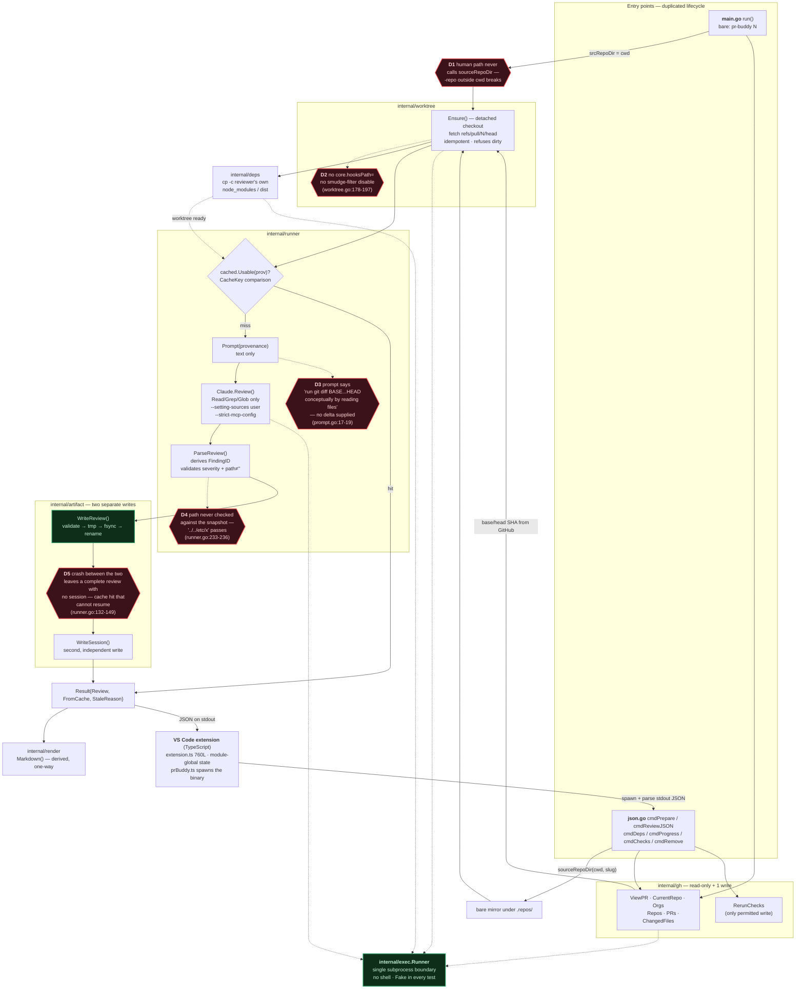
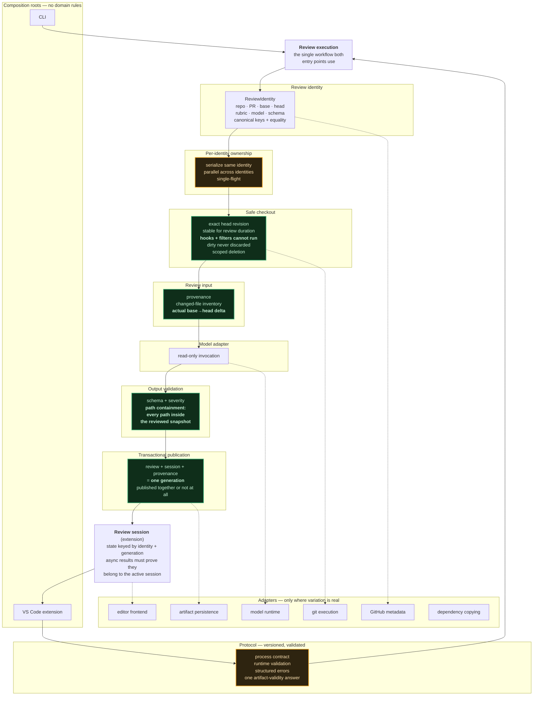
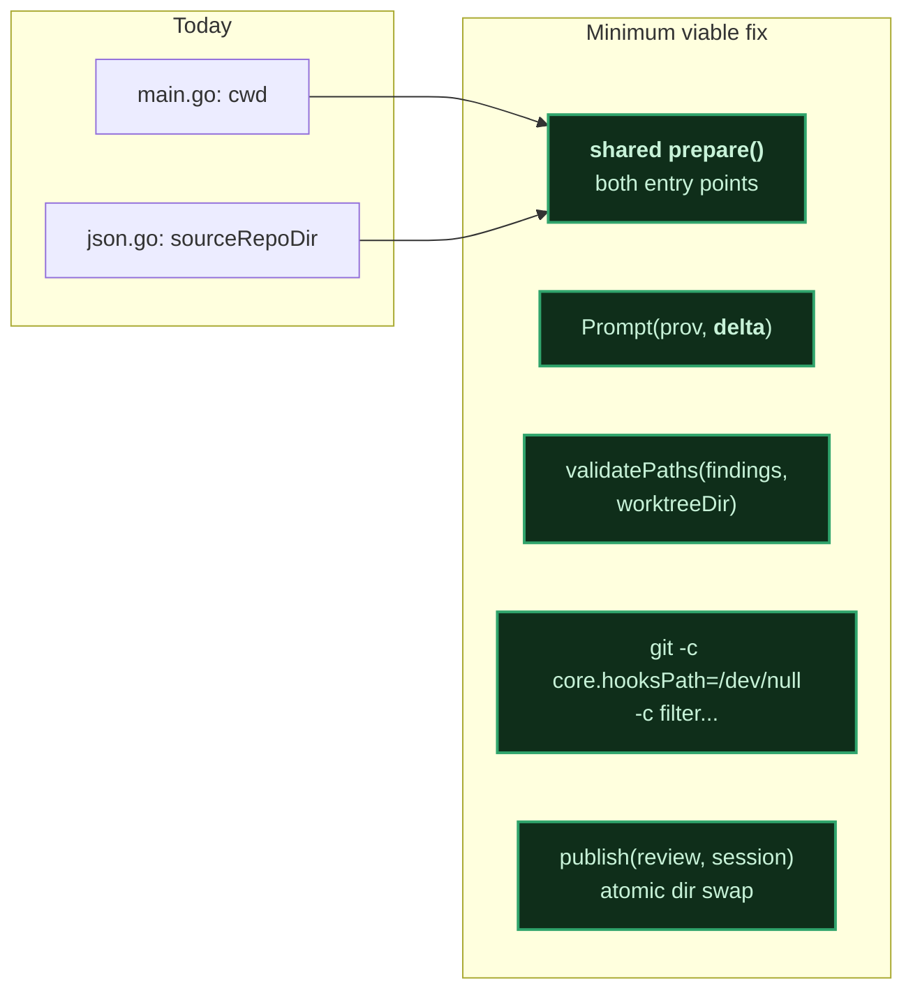

# Architecture: current vs proposed

Both diagrams below are drawn from the code as it exists on `main`, not from
prose descriptions of it. Every defect marked in the "current" diagram was
confirmed at a specific line before being drawn.

---

## Current architecture

### Confirmed defects

| # | Defect | Evidence | Severity |
|---|---|---|---|
| **D1** | Human and JSON paths resolve the repo differently | `main.go:107` passes `cwd` to `Ensure`; `json.go:157` passes `sourceRepoDir(...)`. `pr-buddy -repo other/x 5` from an unrelated directory fetches into the wrong repo. | High |
| **D2** | Checkout does not disable hooks or content filters | No `core.hooksPath=` / `filter.*` anywhere in `worktree.go`. `git worktree add` (`:184`) and `git checkout` (`:193`) run with ambient config. `CLAUDE.md` claims "no hooks" — the code does not enforce it. | High |
| **D3** | Model receives no delta | `prompt.go:17-19` asks the model to reconstruct `base...head` "conceptually by reading the changed files" from a head-only checkout. It cannot see what changed. | High — this is the product hypothesis |
| **D4** | Model paths unvalidated | `runner.go:233-236` checks only that path is non-empty. `store.go:48` repeats the same non-empty check. Nothing constrains a path to the reviewed tree. | High |
| **D5** | Review and session published separately | `runner.go:132` writes the review, `:141` writes the session. Each write is atomic; the **pair** is not. | Medium |

The `DirName` collision the doc lists is **already fixed** — `worktree.go:61-72` appends a
digest when the slug truncates. The doc's Phase 1 item there is stale.

---

## Proposed architecture

Green = fixes a confirmed defect. Amber = speculative, no evidence yet.

---

## The difference, condensed

| Concern | Current | Proposed |
|---|---|---|
| Orchestration | Two entry points, duplicated lifecycle, divergent repo resolution | One `Review execution` both roots call |
| Identity | `Provenance` struct + ad-hoc slug + separate `DirName` | One `ReviewIdentity` owning keys, paths, equality |
| What the model sees | Head checkout + prose asking it to imagine the diff | Head checkout **+ real base→head delta** |
| Untrusted output | Non-empty path check | Path containment against the snapshot |
| Checkout safety | Detached, no remote added; hooks/filters ambient | Hooks and filters provably cannot execute |
| Publication | Two atomic writes, non-atomic pair | One generation, all-or-nothing |
| Concurrency | None | Single-flight per identity, parallel across |
| Extension state | Module globals | Session keyed by identity + generation |
| Go↔TS contract | Duplicated shapes, unvalidated | Versioned, validated, structured errors |

---

## What the diagrams show that the prose does not

Three things become visible once it is drawn:

1. **The defects cluster in two places** — the entry-point fan-in (D1) and the
   runner's trust boundary (D3, D4). They are not spread across the codebase.
   The Go packages themselves are fine.

2. **Four of the five confirmed defects are fixed by localized changes**, not by
   the restructure. Path containment is a function in `runner`. The delta is an
   argument to `Prompt`. Hook disabling is `-c core.hooksPath=/dev/null` on two
   commands. Transactional publish is one directory rename.

3. **The genuinely architectural items are the two amber boxes** — per-identity
   locking and the versioned protocol — and neither addresses a defect that
   exists today. They address defects that would exist in a concurrent,
   multi-consumer world that this tool is not in.

The minimum diff that closes every confirmed defect:

That is five changes against roughly 1,400 lines of non-test Go — not five
phases. Everything else in the plan should wait for the pilot to produce
evidence that it is needed.
